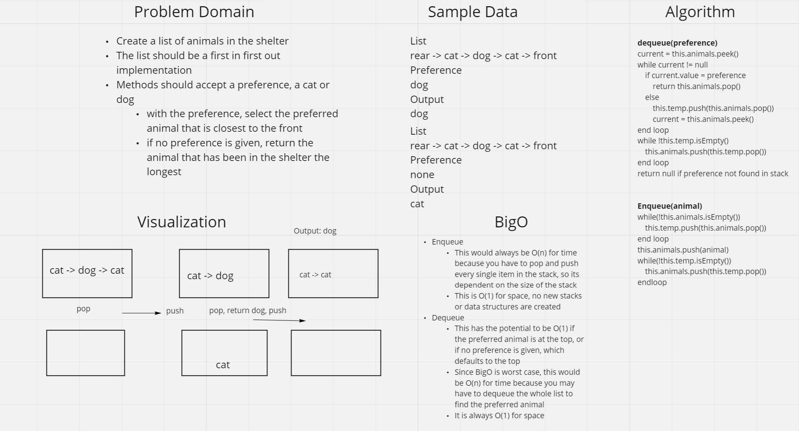

## Class 12

## Challenge
The challenge was to implement a first in first out queue that held animals in a shelter. The enqueue would take in an animal and add it to the rear of the queue. The dequeue would take in a preference and then the animal closest to the top that matched that preference would be removed. If no preference was given, the top most animal is returned. If the preferred animal is not in the shelter, null is returned.

### Whiteboard Process

## Code
[AnimalShelter](https://github.com/BrookeHeck/data-structures-and-algorithms/tree/main/javascript/animal-shelter/index.js)

### Approach & Efficiency
The approach I took was to use two stacks to implement the queue. One stack held the animals in the correct order, with the bottom being the rear and top being the front. When dequeue is called, the animals that don't match the preference are popped from that stack and pushed onto a temporary stack. When the preference is found, that animal is returned after all the animals in the temporary stack are popped and pushed onto the original stack. For enqueue, all the animals must be popped and pushed onto the temporary stack, the new animal must be pushed onto the original stack, and the the animals must be popped from the temporary stack and pushed back onto the original stack.

Both functions have an efficiency of O(n) for time because it depends on how many animals are on the list. Both functions have O(1) for space because no new data structures are being created.