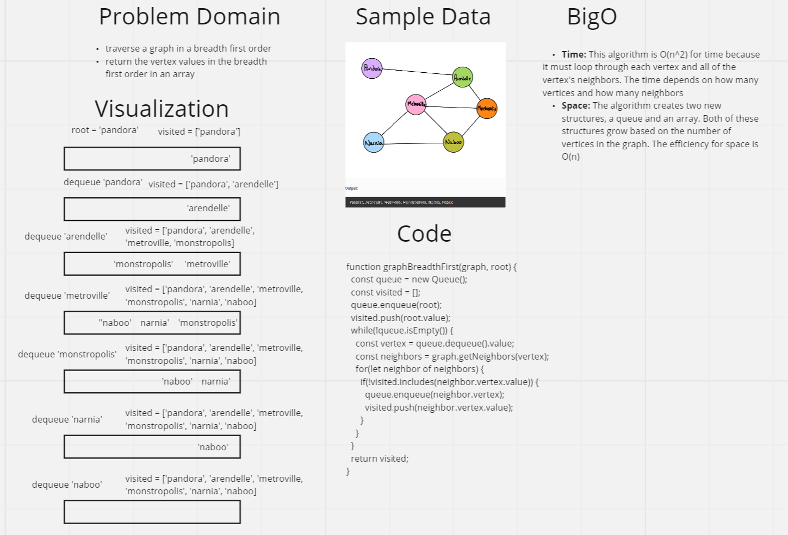

# Breadth First Traversal of a Graph

## Challenge
The challenge was traverse a graph in breadth first order. This means visiting each vertex at the level before traversing the next level in the graph. Because graphs aren't hierarchial like trees, a vertex must be chosen as a root. The root then provides that structure to traverse because you can visit that specific vertex and then move to it's neighbors.

## Approach & Efficiency
For my solution I used a queue as a first in first out structure to keep the correct order of the vertices in a breadth first traversal. This means that a vertex will be dequeued and evaluated before any of it's neighbors, which are placed at the end of the queue. During the evaluation of each vertex, the algorithm finds all of it's neighbors, checks to see if any of the neighbors have already been visited, and adds all the not visited vertices to the queue and the visited array. 

This algorithm is O(n^2) for time efficiency. This is because the algorithm must traverse every vertex, and for each vertex iterate through it's neighbors. The time it takes grows based on the number of vertices and the number of edges. The space efficiency of this algorithm is O(n). Both the queue and array grow based on the number of vertices in the graph.

## Solution
