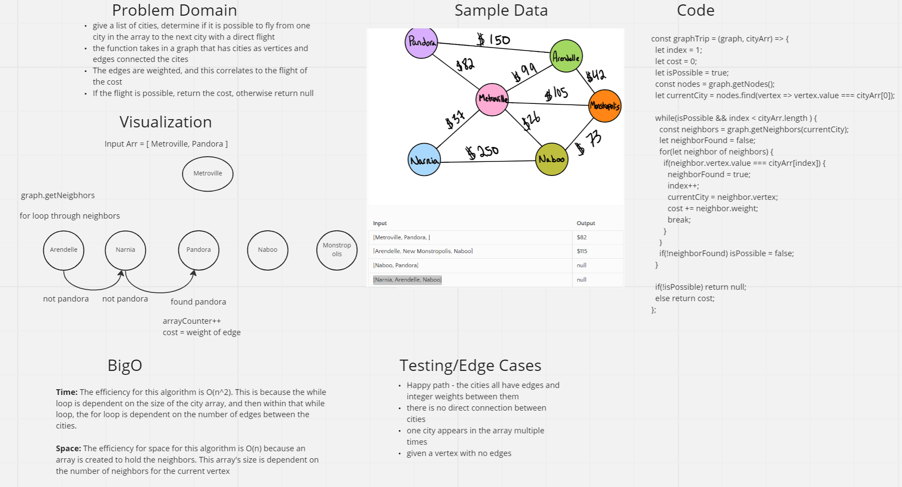

# Graph Business Trip
This challenge had us use a graph of cities and given an array of cities, determine if the trip from one city to the next was possible with direct flights.

## Whiteboard Process


## Approach & Efficiency
I started by getting the vertex of the first city in the array. From there, I could use a while loop to look for neighbors until I reached the final destination. If the vertex had a neighbor that was the city I was looking for, I got that vertex's neighbors and repeated the process. I continued this until my counter hit the length of the city array. I broke out of the loop and returned null if the none of the neighbors was the city I was looking for. 

## Solution
[Graph Trip Function Source Code](https://github.com/BrookeHeck/data-structures-and-algorithms/blob/main/javascript/graph-trip/graph-trip.js)
```js
const graphTrip = require('./graph-trip');
// I already created a graph with edges and weights between cities
const graph = require('./test-graph')

const cost = graphTrip(graph, ['Arendelle', 'Monstropolis', 'Naboo']);
// cost will be equal to 115, the added weights of the edges between these cities

const cost2 = graphTrip(graph, ['Naboo', 'Pandora']);
// there is no direct flight from Naboo to Pandora, cost2 is null
```