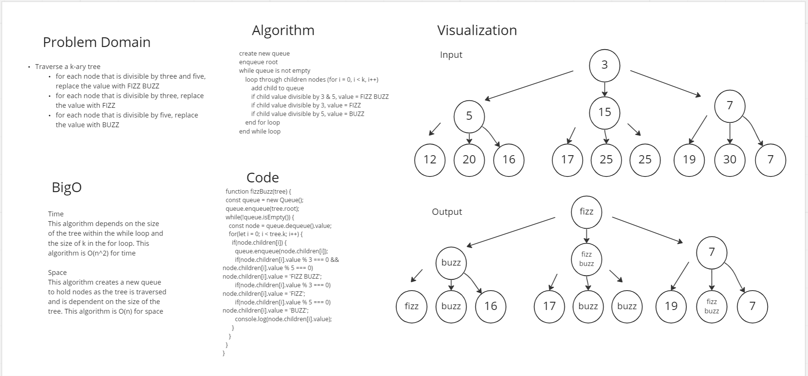

# Code Challenge 18

## Overview
The challenge was to traverse through a k-ary tree and check the value of each node. If the value was divisible by 3 and 5, change the value to fizz buzz. If the value was divisible by three, change the value to fizz. If the value was divisible by 5, change the value to buzz.

## Approach and Efficiency
I used queue to traverse the tree breadth first. I add the root to my queue. Then I started a while loop that dequeue the first node from that queue. THe while loop runs as long as the queue is not empty. I used a nested for loop to get each child node. If the node was not null, I evaluated and changed the value if necessary and added it to my queue. Because this algorithm has nested loops that depend on the size of the tree and the size of the k, it is O(n^2) for time. A queue is created to hold each node during the traversal and it's size is dependent on the size of the tree. This algorithm is O(n) for space.

