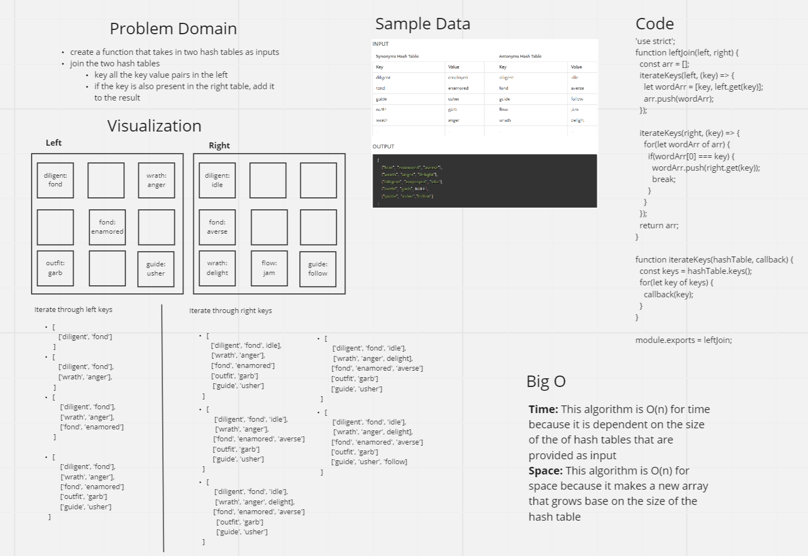

# Hashmap LEFT JOIN

## Challenge
The challenge was to create a function that joined two hash tables. This algorithm did a left join, which means that all the values in the first hashmap are returned and if the values also exist on the second hashmap, they are added to results.

## Approach & Efficiency
I started by creating a function that took in a single hash table and a callback function. This function used the keys method on the hash table to get an array of keys and then iterated through that array of keys. For each iteration, it executed the callback with the key passed as the parameter. In the left join function, I started by making a new array to hold all the arrays of keys and values. With the first hash table, I called the first function I wrote and passed it the left hash  table and a callback that added all the keys and values to the array. Then I called that first function again but passed it the second hash table and a callback that searched through the results array. If the key was in that array, the value of the right hash table was also added.

## Solution
[Solution Code](https://github.com/BrookeHeck/data-structures-and-algorithms/blob/main/javascript/left-join/left-join.js)

