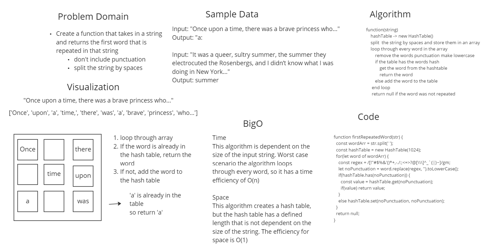

# Challenge Summary
This challenge was to make a function that took in a string and returned the first repeated word in the string. 

## Whiteboard Process


## Approach & Efficiency
I decided to split the string using spaces as the deliminator to make an array of all the words. Then I started iterating through that array. I also created a new hash map to store words in. I decided to use a hash map because it is very efficient way to store and retrieve data. For each word that is iterated through, I check to see if it is already in the hash table. If it is, the function returns that word and if not it adds the table to the hashmap. If the algorithm makes it to to the end of the loop, the function will return null to indicate that there is no repeated words.

## Solution
- require the function exported by the repeated-word.js
- call the function and pass a string as a parameter
- if the string has a repeated word it will return that word, otherwise the function will return null.

```js
const getRepeatedWord = 'repeated-word';

const str = 'Once upon a time, there was a brave princess who...'

const word = getRepeatedWord(str);
// word will equal 'a'
```