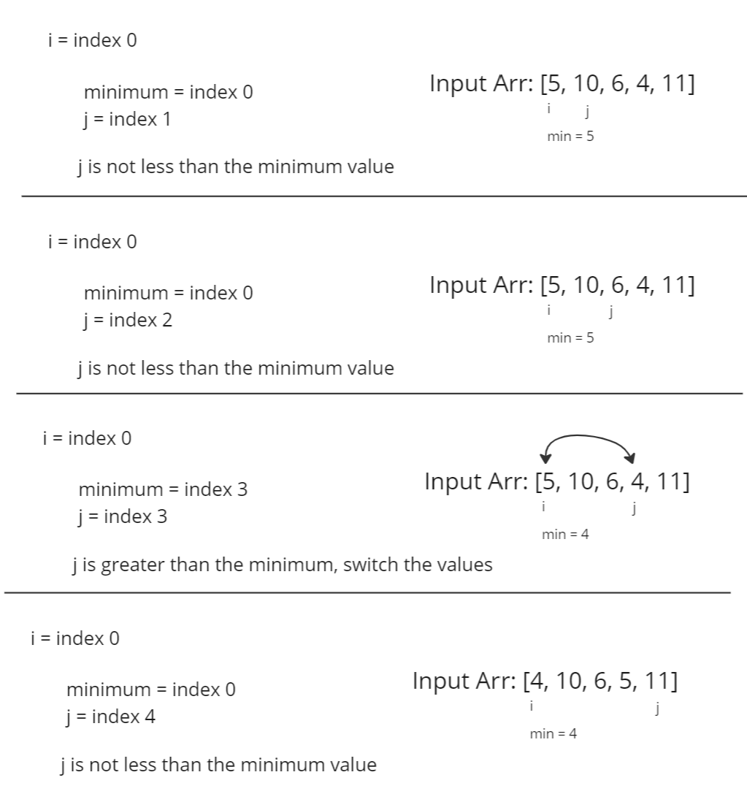
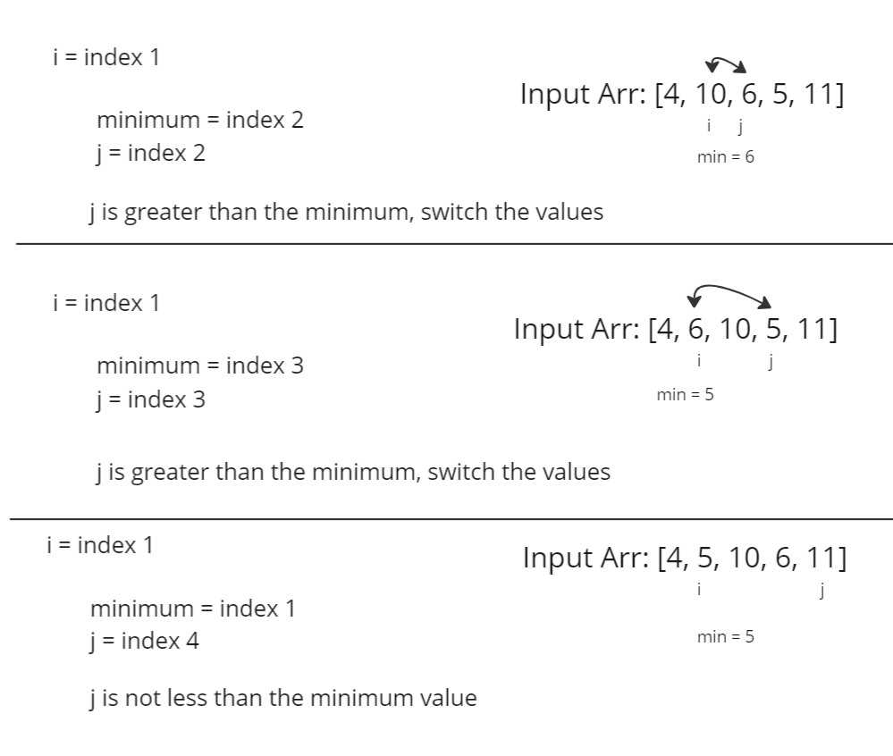
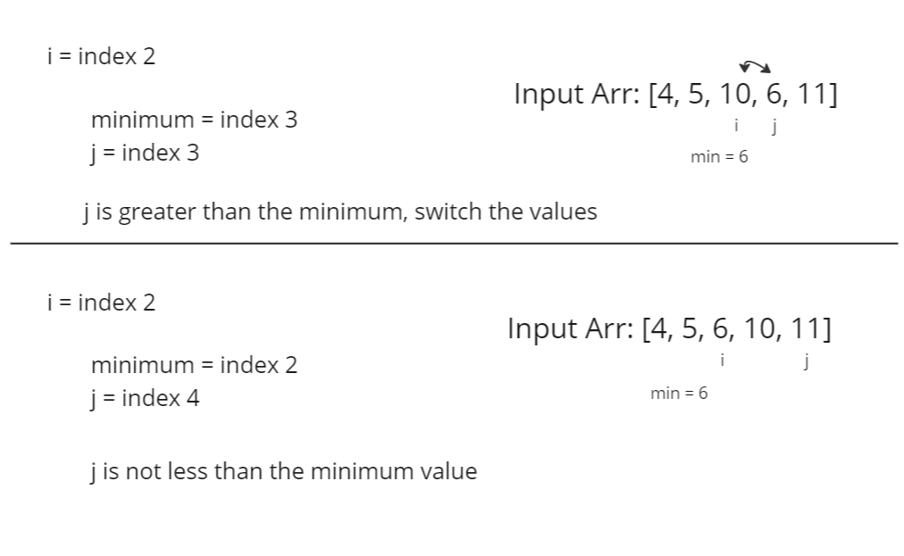
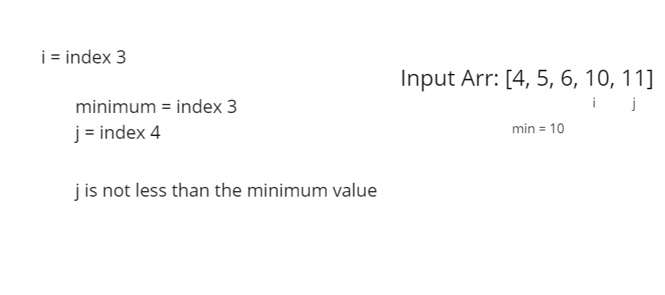

# Selection Sort

Selection sort is an algorithm for sorting an array. It starts by finding the minimum value to put at index 0. It does this by setting a variable to the integer at value 0, and comparing it to the rest of the array. If any values are less than what is currently index 0, the two values are switched. This is then repeated for each index in the array. Below is an example of stepping through each iteration in a selection sort.

## Stepping Through a Selection Sort

</br>

</br>

</br>


## Pseudocode
```js
SelectionSort(int[] arr)
    DECLARE n <-- arr.Length;
    FOR i = 0; i to n - 1  
        DECLARE min <-- i;
        FOR j = i + 1 to n
            if (arr[j] < arr[min])
                min <-- j;

        DECLARE temp <-- arr[min];
        arr[min] <-- arr[i];
        arr[i] <-- temp;
```

## An Example in JavaScript
```js
function selectionSort(arr) {
  const n = arr.length;
  for(let i = 0; i < n; i++) {
    let min = i;
    for(let j = (i + 1); j <= n; j++) {
      if(arr[j] < arr[min]) {
        min = j;
      }
    }
    let temp = arr[min];
    arr[min] = arr[i];
    arr[i] = temp;
  }
}
```

## Big O Notation
This sorting algorithm is O(n^2) for time efficiency. The algorithm loops through the input array n times, and then n-1 times in the nested loop. This means the algorithm will iterate n * n-1 times, giving us n^2.

This algorithm is O(1) for space efficiency. No additional space is being created because the array is being sorted in place. The space remains constant.

## Resources
[Selection Sort](https://codefellows.github.io/common_curriculum/data_structures_and_algorithms/Code_401/class-26/solutions/BLOG)

