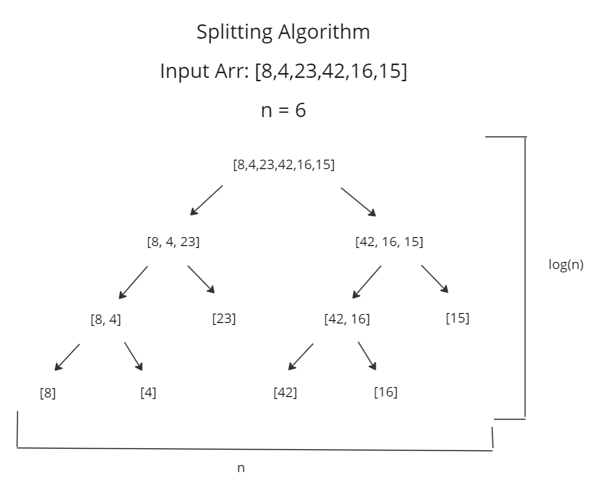
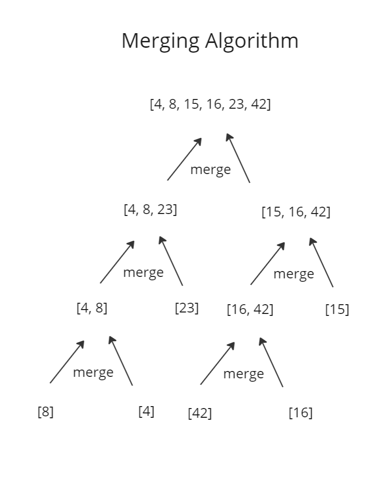

# Merge Sort

## What is Merge Sort
Merge sort is a recursive algorithm that sorts an array by splitting them in half until it hits a base case. The base case is when you have split the array as many times as possible, and then you work your back up by merging the split arrays. When all the split arrays have been merged, you end up with the full array, but it is sorted. This algorithm has an advantage of being more efficient for time compared to other sorting algorithms. The following sections will walk you through how to implement a merge sort and why it is a time efficient sorting algorithm.

## Stepping Through a Merge Sort




## Pseudocode
```js
ALGORITHM Mergesort(arr)
    DECLARE n <-- arr.length

    if n > 1
      DECLARE mid <-- n/2
      DECLARE left <-- arr[0...mid]
      DECLARE right <-- arr[mid...n]
      // sort the left side
      Mergesort(left)
      // sort the right side
      Mergesort(right)
      // merge the sorted left and right sides together
      Merge(left, right, arr)

ALGORITHM Merge(left, right, arr)
    DECLARE i <-- 0
    DECLARE j <-- 0
    DECLARE k <-- 0

    while i < left.length && j < right.length
        if left[i] <= right[j]
            arr[k] <-- left[i]
            i <-- i + 1
        else
            arr[k] <-- right[j]
            j <-- j + 1

        k <-- k + 1

    if i = left.length
       set remaining entries in arr to remaining values in right
    else
       set remaining entries in arr to remaining values in left
```

## An Example in JS

## Big O
### Time
This algorithm is O(n * log(n)). The splitting algorithm happens log(n) times. The merging algorithm happens n - 1 times. When you combine both these efficiencies you get a O(n * log(n)).

### Space
This algorithm requires a temporary array to be when merging the left and right arrays. The array is dependent on the n, so we can O(n) efficiency for space.

## Resources
[Algorithms: Merge Sort](https://www.youtube.com/watch?v=KF2j-9iSf4Q)

[Merge Sort Pseudocode](https://codefellows.github.io/common_curriculum/data_structures_and_algorithms/Code_401/class-27/)

[Why Is Merge Sort O(n * log(n))? The Really Really Long Answer.](https://www.youtube.com/watch?v=alJswNJ4P3U)