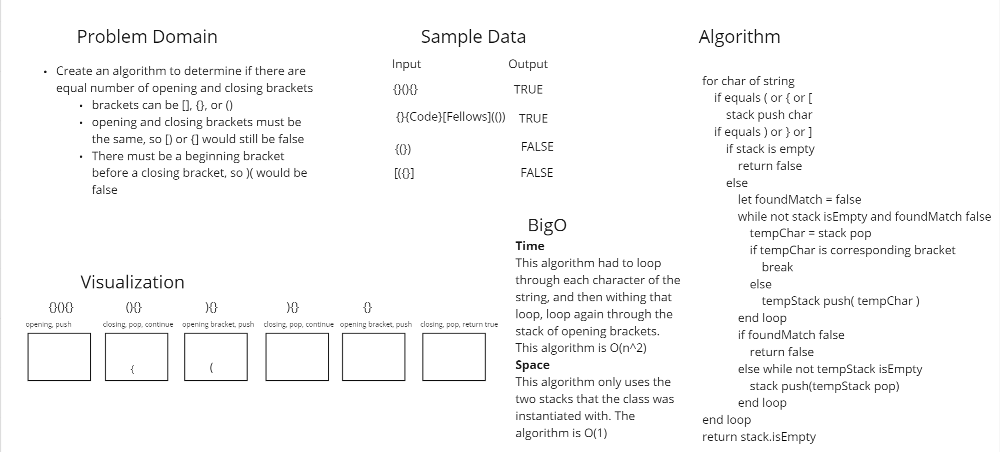

# Challenge Summary
This challenge was to create an algorithm that determined if there was a closing bracket for all the opening brackets. The closing bracket must correspond to the opening bracket. So, { needs }, [ needs ], and ( needs ). The opening bracket must become before the closing bracket.

## Whiteboard Process

## Approach & Efficiency
I started by looping through each character in the string. If char was an opening bracket, I pushed it onto a stack to look for later. If the bracket was a closing bracket, I popped the the top of the stack and compared the two. If they matched, continued to the next character in the string. If it was not the corresponding opening bracket, I added the popped node to a temporary stack. If a match was found in the stack, I returned all the brackets in the temporary stack to the original stack and continued to the next character. If I didn't find a match I returned false. Anything that wasn't a bracket was disregarded. When I made it through all the characters, I checked my original stack. If it was empty, I could return true because all opening brackets had a closing bracket. If the stack was not empty I returned false.
