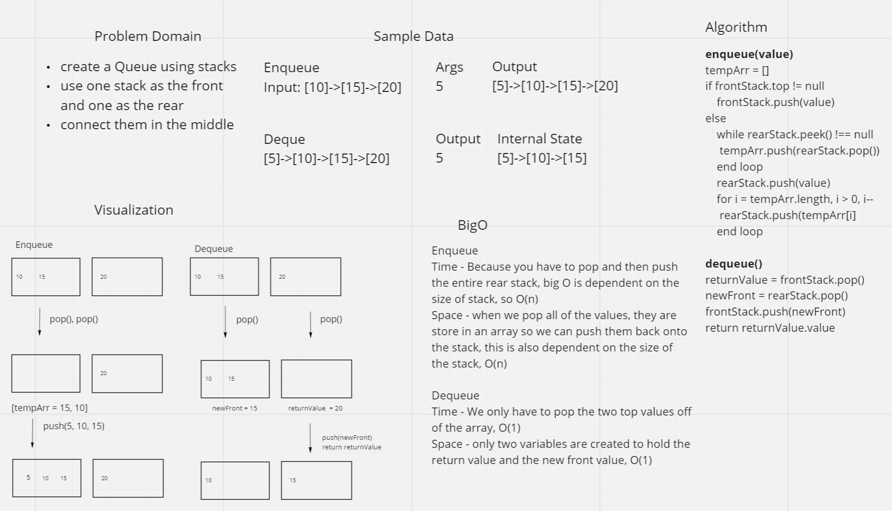

## Class 11

### Whiteboard Process

### Approach & Efficiency
The approach I took was to use one stack as the queue front and the other as the queue rear. The front only had the top value, while the rear held all the other values. The dequeue was efficient because all I had to do was pop the both stacks, push the popped value from the rear stack onto the front stack, and return the popped value from the front stack. This was O(1) for both time and space. Enqueueing was not as efficient. Since I needed to add the value to the bottom of the stack, I had to pop the stack until it was empty, push on the new node, and the push all the nodes back onto my rear stack. This was O(n) for both time and space.