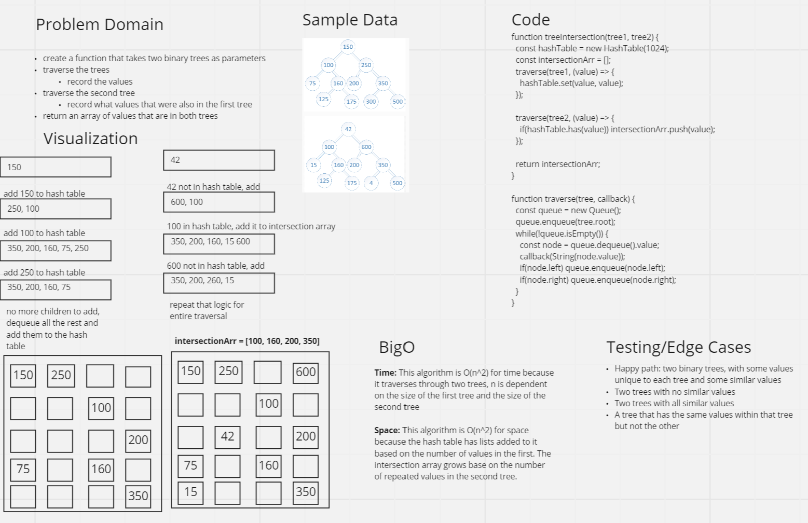

# Challenge Summary
The challenge was to make a function that takes in two binary trees and return an array of values that appear in both trees.

## Whiteboard Process


## Approach & Efficiency
My approach was to do a breadth first search through each of the trees. For every node through the traversal, I executed a callback function and passed the callback the node. The callback for the first tree traversal was to add every value to the tree. For the second tree, the callback was to check if the tree was already in the hash table. If it was, then it was added to the intersection array. I used a hash table because they are an efficient way to store and get values later. To get the value I'm looking for, I don't have to iterate through a list, instead I can look it up using a hash.

## Solution
[Solution Source Code](https://github.com/BrookeHeck/data-structures-and-algorithms/blob/main/javascript/tree-intersection/tree-intersection.js)

- import the function and pass two binary trees as the input
- the function will return an array of values that are in both trees
```js
const treeIntersection = ('tree-intersection');

const tree1 = new BinaryTree(1);
const tree2 = new BinaryTree(2);
// add values to your trees

const intersectionArray = treeIntersection(tree1, tree2)
```