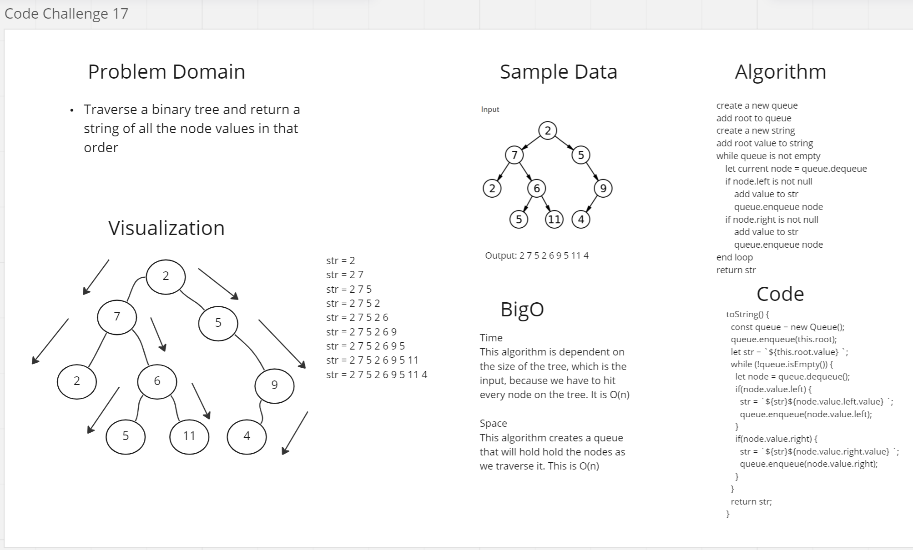

# Binary Trees

## Challenge
The challenge was to create a class that implemented a binary tree. A binary tree is a data structure that has a node as the root of the structure. Every single node has two children, a left and right children. The structure grows off the root by adding nodes to the left and right of the root and then continuing that pattern all the way down. The tree can be traversed in two ways, breadth first and depth first. Breadth first traverses the tree by hitting every node at that height before moving moving down. The depth first search traverses the full height of the tree, works its way back up, and then traverses to the left or right.

## Approach & Efficiency
To instantiate the tree, give the root node a value. From there, to add a node I did a breadth first search from left to right. I decided to use a breadth first search so that a level of the tree is filled out before moving on to the next. If I did a depth first search, I would have always added to the same side of the tree. For the contains method, I could have traversed the tree breadth or depth first. I decided to depth first, and the algorithm will iterate over all the nodes from top to bottom first and then move to the right. If the node is found, then the algorithm stops and returns true. If all the nodes have been iterated, and the node hasn't been found, it returns false.

## API
- Instantiate - create an instance of the binary tree by requiring the module, and using the new keyword to make a binary tree object, when instantiating give the root value to the constructor

```const binaryTree = new BinaryTree(1)```

- Add - to add a node, call the add method and give it the value of the new node as a parameter, nodes are added from left to right, and then down if all nodes are filled at that height

```binaryTree.add(2)```

- Contains - to see if the tree contains a value, call the contains method and provide it with a search key as a parameter, true will be returned if the value is found and false if it is not

```binaryTree.contains(2)```

this will return true

```binaryTree.contains(3)```

this will return false

- getMax - iterates through the tree and finds the node with the highest value, only works on a tree with numbers, the value of that node will be returned

```binaryTree.getMax()```

this will return 2

- toString - iterates over the tree in a breadth first traversal and returns a string with all the values in the tree

```binaryTree.toString()```


## Code Challenge 16
The challenge was to iterate through a binary tree and find the node with the highest value. I did this in a very similar way to contains. The method added to the binary tree class should return the value of the node.

## Approach and Efficiency
I took a very similar approach to this challenge as I did the contains method. To start I set the root value as the max value. Then I did a depth first search using a stack. I checked the value of each of node through as I traversed. If the value of the node was higher than the max variable, I changed the max variable to that node's value. When I made it through the entire loop, I returned the value.


</br>

## Code Challenge 17
The challenge was to do breadth first search and print out all the node values in that order.

## Approach and Efficiency
I used a queue to do a breadth first search. I started by enqueueing the root and adding that value to my string. Then I started a while loop that started by dequeueing the the first node. If there was a left and right node, the value was added to the string and nodes were added to the queue. When the queue is empty, the the while loop ends and every single value in the tree is in the string and I can return that string. This algorithm is O(n) for both time and space.



