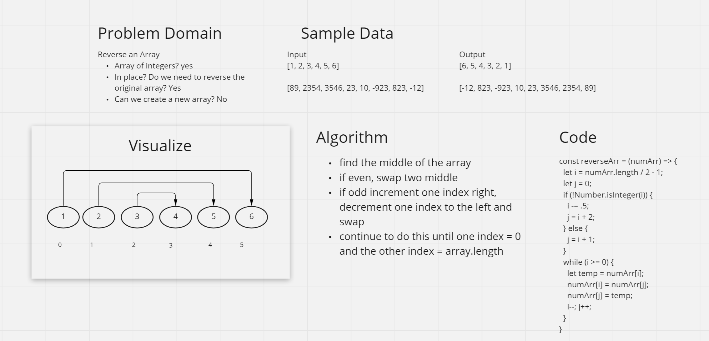
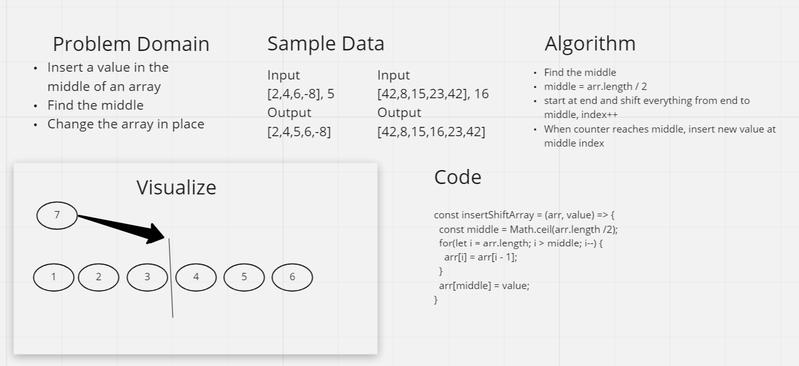

# 401 Whiteboard Challenges

## Class 01

### Whiteboard Process

### Approach & Efficiency
One approach I took to make this algorithm better was to alter the array in place. By doing this, I didn't have to create a second array. I also decided to start in the middle and work my way out. This is more efficient than popping off the last element and putting it in the front because this algorithm performs half the amount of iterations.

## Class 02
### Whiteboard Process

### Approach & Efficiency
One approach I took to make this algorithm better was to alter the array in place. By doing this, I didn't have to create a second array. I'm not sure shifting every single element over one was the most efficient way to do this, but it is the best solution I could come up with.