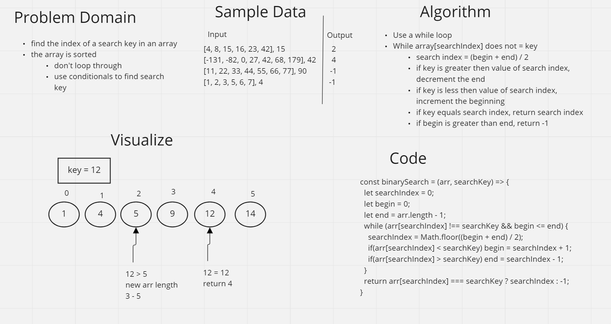
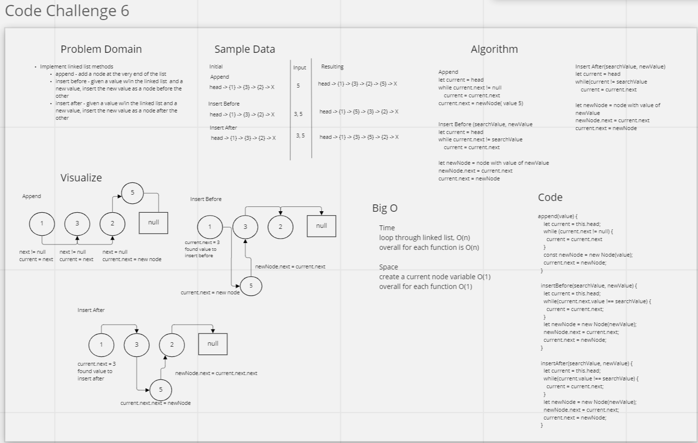
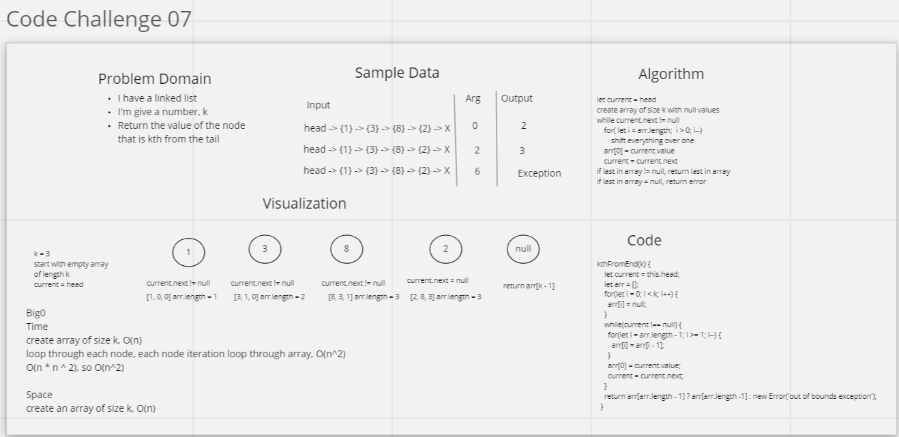
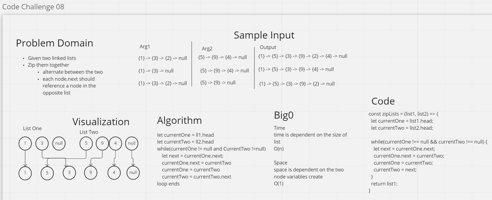

# 401 Whiteboard Challenges

## Class 01

### Whiteboard Process

### Approach & Efficiency
One approach I took to make this algorithm better was to alter the array in place. By doing this, I didn't have to create a second array. I also decided to start in the middle and work my way out. This is more efficient than popping off the last element and putting it in the front because this algorithm performs half the amount of iterations.

 

## Class 02
### Whiteboard Process

### Approach & Efficiency
One approach I took to make this algorithm better was to alter the array in place. By doing this, I didn't have to create a second array. I'm not sure shifting every single element over one was the most efficient way to do this, but it is the best solution I could come up with.

 

## Class 03
### Whiteboard Process

### Approach & Efficiency
A binary search doesn't iterate through every single element until it finds what it's looking for. If there was a lot of data, and we were searching for something at the end of the array, this would take longer. My approach still used a loop, but it used a while loop, and this while loop cut the array in half until the value of the search index matched the search key. Incrementing or decrementing the end or beginning based on the value of the search index being greater or less than the search key only worked because I was searching a sorted array.

 

## Class 06

### Whiteboard Process

### Approach & Efficiency
The approach I took for all of these were basically the same, the only difference was where I inserted the new node. To start with I had to search for the right place to insert the value. Once I found it, then I was able to just change the next references so that the nodes were all in the right order.

 

## Class 07

### Whiteboard Process

### Approach & Efficiency
The approach I took was to make an array of size k and then keep track of the last values in the list using that array. When I hit the tail, I returned the value at the end of the array, because this represented the value that was inserted earliest. I don't think this is a very efficient algorithm, but since this is a singly linked and not doubly linked, it's the best I could come up with.

 

## Class 08

### Whiteboard Process

### Approach & Efficiency
The approach I took was to start with the list that method was invoked on, and than make the next of that head to point to the head of the list passed into the method. I alternated back and forth between the two lists until the two lists were zipped together.