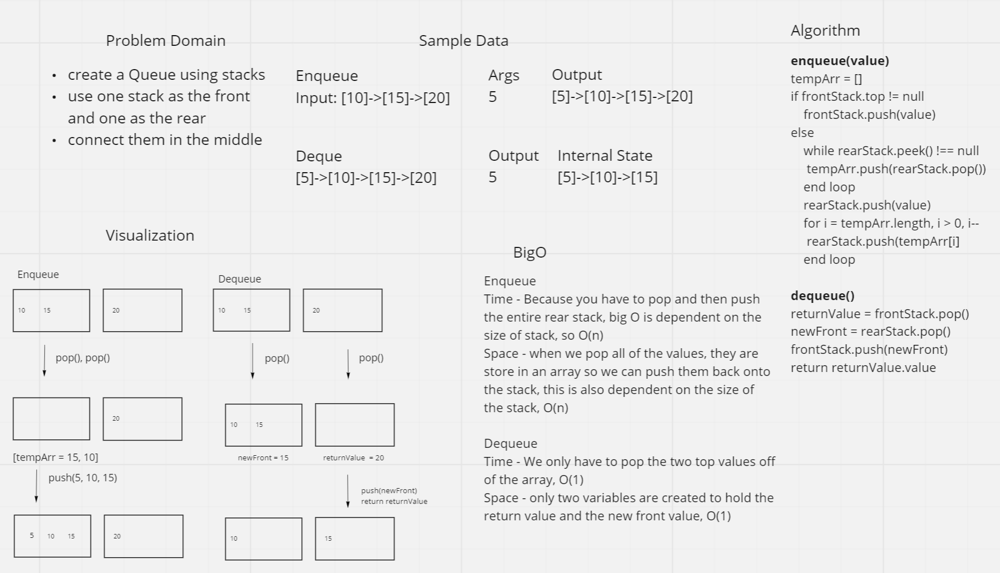

# 401 Whiteboard Challenges

## Class 01

### Whiteboard Process

### Approach & Efficiency
One approach I took to make this algorithm better was to alter the array in place. By doing this, I didn't have to create a second array. I also decided to start in the middle and work my way out. This is more efficient than popping off the last element and putting it in the front because this algorithm performs half the amount of iterations.

 

## Class 02
### Whiteboard Process

### Approach & Efficiency
One approach I took to make this algorithm better was to alter the array in place. By doing this, I didn't have to create a second array. I'm not sure shifting every single element over one was the most efficient way to do this, but it is the best solution I could come up with.

 

## Class 03
### Whiteboard Process

### Approach & Efficiency
A binary search doesn't iterate through every single element until it finds what it's looking for. If there was a lot of data, and we were searching for something at the end of the array, this would take longer. My approach still used a loop, but it used a while loop, and this while loop cut the array in half until the value of the search index matched the search key. Incrementing or decrementing the end or beginning based on the value of the search index being greater or less than the search key only worked because I was searching a sorted array.

 

## Class 06

### Whiteboard Process

### Approach & Efficiency
The approach I took for all of these were basically the same, the only difference was where I inserted the new node. To start with I had to search for the right place to insert the value. Once I found it, then I was able to just change the next references so that the nodes were all in the right order.

 

## Class 07

### Whiteboard Process

### Approach & Efficiency
The approach I took was to make an array of size k and then keep track of the last values in the list using that array. When I hit the tail, I returned the value at the end of the array, because this represented the value that was inserted earliest. I don't think this is a very efficient algorithm, but since this is a singly linked and not doubly linked, it's the best I could come up with.

 

## Class 08

### Whiteboard Process

### Approach & Efficiency
The approach I took was to start with the list that method was invoked on, and than make the next of that head to point to the head of the list passed into the method. I alternated back and forth between the two lists until the two lists were zipped together.

 

## Class 09

### Whiteboard Process

### Approach & Efficiency
The approach I took was to iterate through the list and always hold to of the nodes as variables, the previous and current node. I was able to just change the next references to the previous node until I hit the last node. Before I looped I had to change the next of head to null and at the end I had to change the head to the last node of the original list.

### Whiteboard Process

### Approach & Efficiency
The approach I took was to store the nodes in an array. Then I looped through that array and compared the head of the list to the end of the list. Then I iterated through the list and through the array in reverse comparing the values with each iteration. If all values matched, I returned true.

 

## Class 11

### Whiteboard Process

### Approach & Efficiency
The approach I took was to use one stack as the queue front and the other as the queue rear. The front only had the top value, while the rear held all the other values. The dequeue was efficient because all I had to do was pop the both stacks, push the popped value from the rear stack onto the front stack, and return the popped value from the front stack. This was O(1) for both time and space. Enqueueing was not as efficient. Since I needed to add the value to the bottom of the stack, I had to pop the stack until it was empty, push on the new node, and the push all the nodes back onto my rear stack. This was O(n) for both time and space.

## Class 14

### Challenge
The challenge was to create a queue method that emulated duck duck goose. The method would take an integer, k, as an argument, and then I would need to iterate through the queue k times and remove only the node that was the kth node. When one node was left, I would return that value.

### Whiteboard Process

### Approach & Efficiency
The approach I took was dequeue and enqueue the value I just dequeued until I hit the kth value. I used a counter to keep track of when I hit k and then reset it. When the counter hit k, I did a dequeue without a enqueue and reset the counter. All this happened inside the while loop until the front value had a next of null. This meant that I only had one node left in the queue. This broke me out of the loop and finally I return the value. The time depends of the size of the queue, so this is O(n) for time. There are no growing variables in this algorithm so it is O(1) for space.